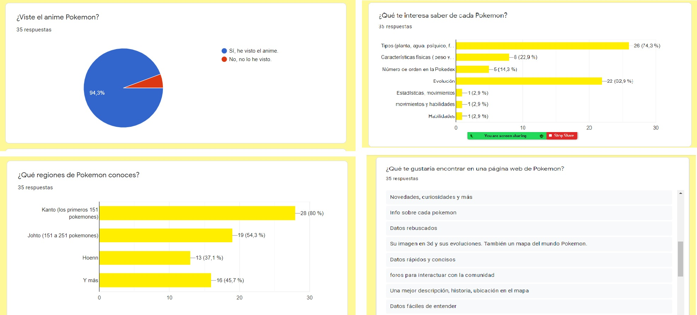
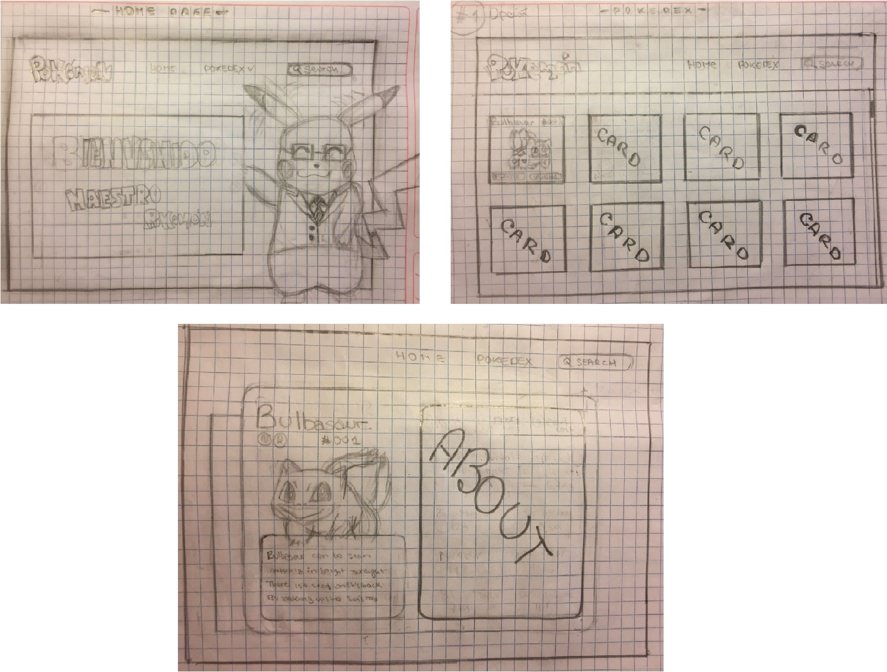
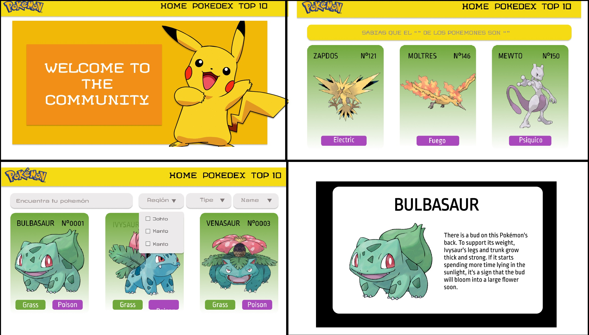
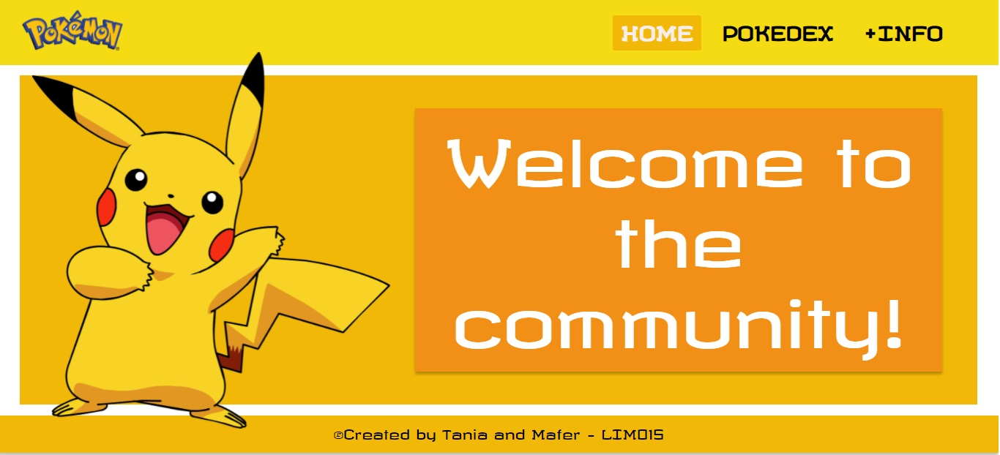
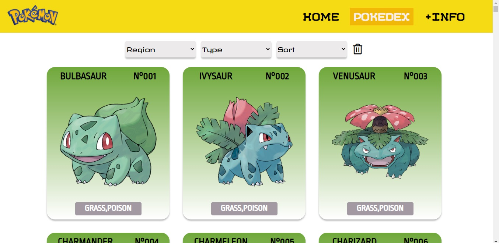
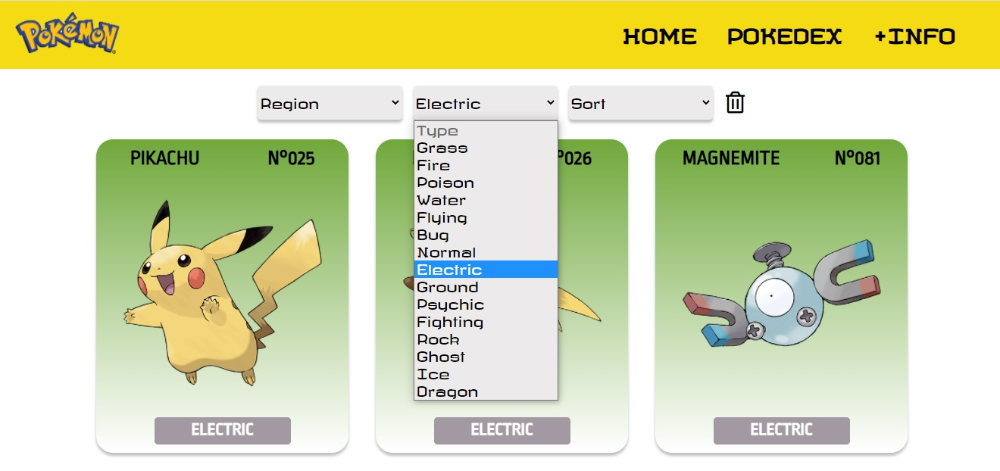
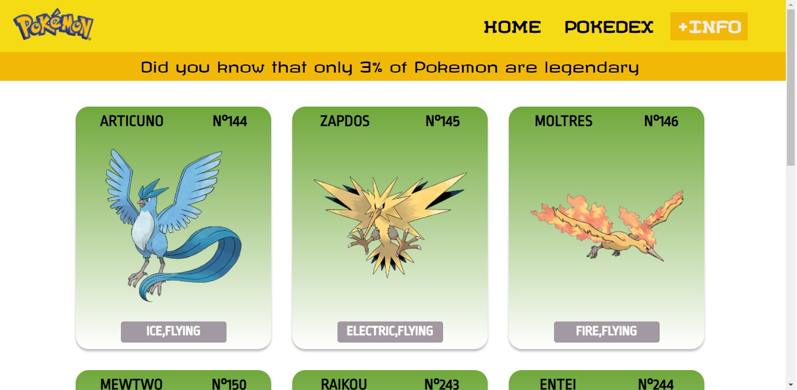

# POKEMON: Welcome to the community!

## Índice

* [1. Resumen](#1-resumen)
* [2. Investigando al usuario](#2-investigando-al-usuario)
* [3. Prototipado en papel](#3-prototipado-en-papel)
* [4. Historias de Usuario](#4-historias-de-usuario)
* [5. Prototipado en alta fidelidad](#5-prototipado-en-alta-fidelidad)
* [6. Página web](#6-página-web)

***

## 1. Resumen

Según [Forbes](https://www.forbes.com/sites/bernardmarr/2018/05/21/how-much-data-do-we-create-every-day-the-mind-blowing-stats-everyone-should-read),

## 2. Investigando al usuario
Comenzamos realizando una encuesta para conocer a los usuarios sobre el mundo pokemon. Obtuvimos que el 94.6% habia visto el anime de pokemon, ademas a la mayoria le interesaba saber el tipo de cada pokemon principalmente. Como sugerencia la mayoria indico que le gustaria una interfaz bonita asi como datos curiosos sobre los pokemones.

## 3. Prototipado en papel
Realizamos el prototipado de baja fidelidad en papel

## 4. Historias de usuario
Creamos las historias de usuario basandonos en la cuesta realizada y las opciones que habian tenido mayor aceptación por parte de los encuestados.

Historia de usuario 1:
Yo como usuario que conoce el anime pokemon quiero una página que me permita ver todos los pokemones para poder conocerlos mejor.
*Criterios de aceptación
-La pagina debe mostrar la imagen y el nombre de todos los pokemones en una carta.

Historia de usuario 2:
Yo como usuario que conoce el anime pokemon quiero una pagina que me permita filtrar los pokemones por tipo, region y ordenarlos alfabeticamente para poder encontrarlos más rápido
-La pagina debe poder filtrar los pokemones por tipo.
-La pagina debe poder filtrar los pokemones por región.
-La pagina debe poder ordenar los pokemones alfabéticamente.

## 5. Prototipo de alta fidelidad
Realizamos el prototipado de alta fidelidad

## 6. Pagina web
Finalmente el resultado fue este:

